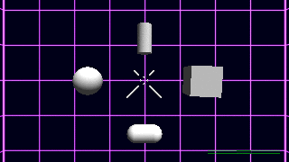

TargetUIFun
==================

Just playing around with Unity's new UI!  You should too!  Everything in the project works on Unity Basic! :D

Most of the pertinent files are in the [$TargetUIFun](Assets/%24TargetUIFun) folder
